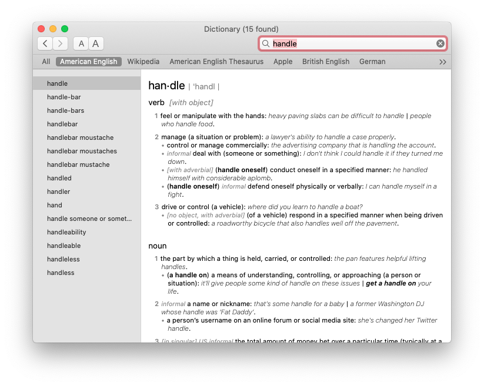
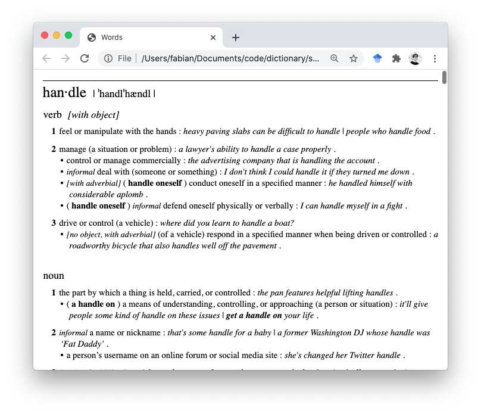

# parse_dictionaries

Parses the beautiful Apple Dictionary.

Here is what the built-in Dictionary app gives for "handle":

<div align="center">
  
</div>

And here is what this script gives (on a Mac), with

```bash
# New Oxford American Dictionary
# NOTE: might be at a different location for you!
NOAD='/System/Library/AssetsV2/ \
       com_apple_MobileAsset_DictionaryServices_dictionaryOSX/ \
       4094df88727a054b658681dfb74f23702d3c985e.asset/ \
       AssetData/ \
       New Oxford American Dictionary.dictionary/ \
       Contents/Resources/Body.data'

python reverse_data.py \ 
        --dictionary_path $NOAD --lookup handle --output_path lookup/lookup.html
```

<div align="center">
  
</div>
